# Звуки и инициали

## Органы

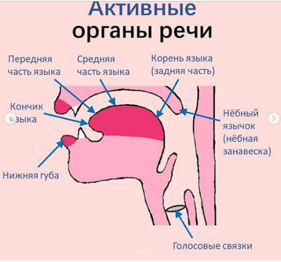

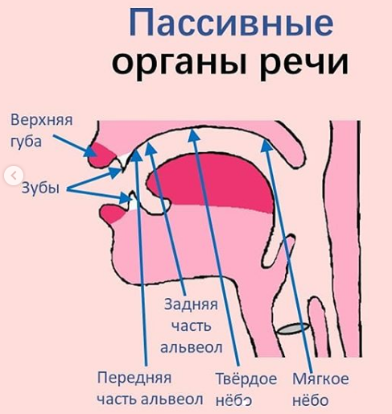

## Звучность

1. Глухие: не участвуют голосовые связки, т.е. эти звуки можно легко сказать шёпотом.
2. Полузвонкие: голос «включается» в самый последний момент – прямо во время отсоединения языка от нёба (или др. участвующих органов).
3. Звонкие: участвует голос, т.е. шёпотом не получится сказать эти звуки.

## Место образования

1. Щелевые: язык приближается к нёбу, но ни разу его не касается – звук возникает через узкую щель. Такие звуки можно было бы бесконечно тянуть. Например, hhhhhhhhh.
2. Смычные: язык один раз касается нёба: сначала язык соприкасается (смыкается) с нёбом (или др. участвующими органами), а потом отсоединяется, и за счёт этого отсоединения получается звук.

## p b m f

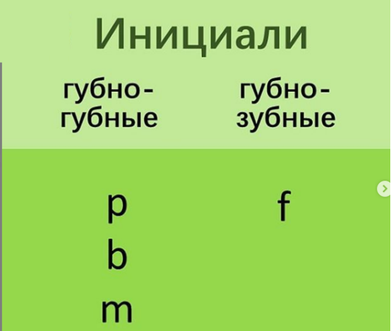
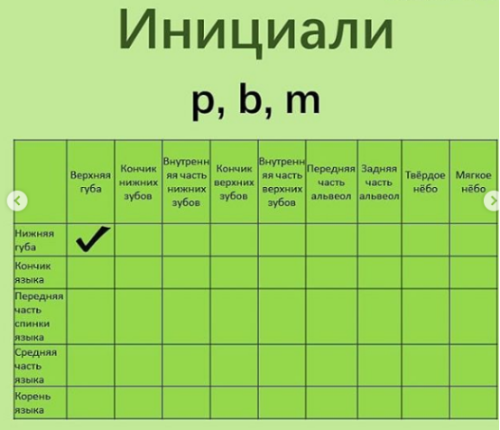
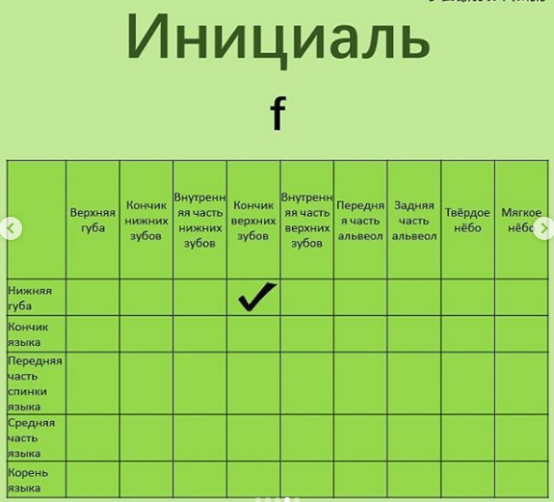

Для этих звуков используем только губы или губы и верхние зубы.

- «p» – произносим «п» на резком выдохе, с шумом выдыхая воздух. Представьте, что одним таким выдохом вам нужно задуть свечку. Удобнее произносить из положения поджатых губ. На слух китайский звук «p» воспринимается, словно после него есть призвук «h».

- «b» – представьте, что вам нужно произнести «б» так, чтобы пламя свечки, поднесённое прямо ко рту, ни капли не шелохнулось. На слух китайский звук «b» воспринимается как среднее между русскими «п» и «б».

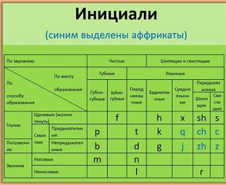

## d t n l

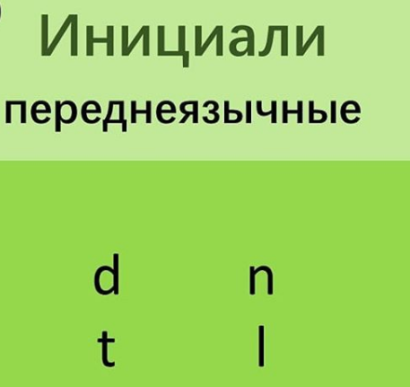
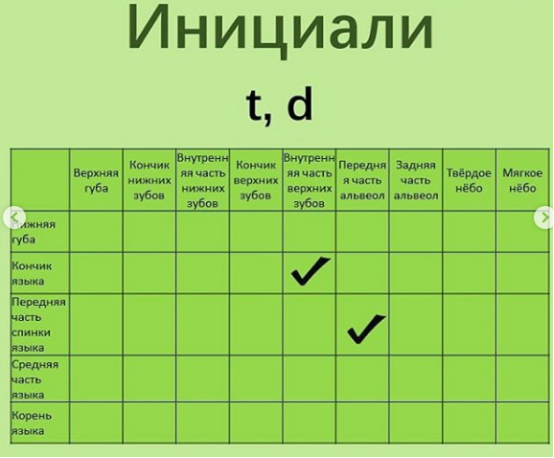
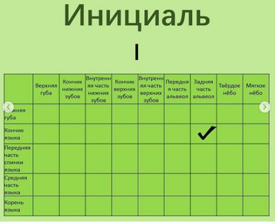
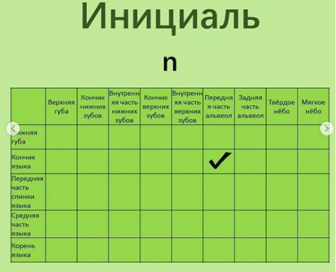

- «d» – произносим русский «д», но, как и в «b» произносим его «аккуратно» – вообще не выдыхая воздух. Словно нельзя, чтобы пламя свечки, поднесённой ко рту, даже чуть-чуть шелохнулось. Как будто мы хотим произнести «d» только за счёт того, что язык отмыкается от нёба. 
На слух китайский звук «d» воспринимается как среднее между русскими «д» и «т».

- «t» – произносим «т» на резком выдохе, с шумом выдыхая воздух, сложно нужно разом задуть свечку. На слух китайский звук «t» воспринимается, словно после него есть призвук «h»

- «n» – произносим «н», только кончик языка касается альвеол. Именно и ТОЛЬКО кончик: т.е. язык становится «острым».

- «l» – произносим «л», только кончик языка касается альвеол. Тоже ТОЛЬКО кончик.

Разница между расположением при «n» и «l» в том, что в «l» кончик языка заворачивается чуть дальше к глотке. Поэтому в таблице есть разделение на переднюю часть альвеол (ближе к зубам) и заднюю часть альвеол (ближе к глотке).

## h g k

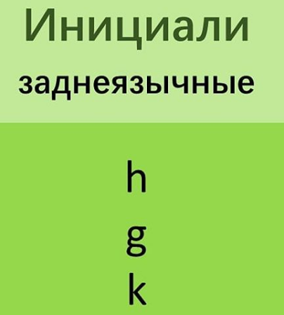
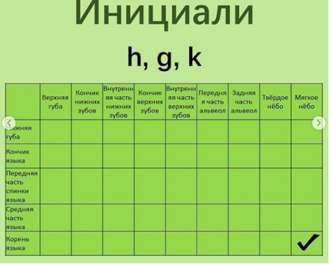

Для этих звуков используем заднюю часть языка (корень языка) и мягкое нёбо.

- «h» – произносим русский «х», но менее интенсивно – просто как выдох.

- «g» – представляем, что нужно произнести «г» так, чтобы пламя свечки, поднесённое прямо ко рту, ни капли не шелохнулось, т.е. очень аккуратно.

- «k» – произносим русский «к» на резком выдохе, с шумом выдыхая воздух, сложно нужно разом задуть свечку. Этот звук тоже более задний по сравнению с русским «к».
На слух китайский звук «k» воспринимается, словно после него есть призвук «h».

В китайском же такого предварительного мычания нет – это получается сделать за счёт того, что мы произносим звуки аккуратно, словно боимся выдохнуть хоть сколько-нибудь воздуха. Пламя свечки очень помогает себя проконтролировать – поднеся его ко рту, пламя вообще не должно шелохнуться.

https://dictionary.writtenchinese.com/worddetail/hao/770/1/1

