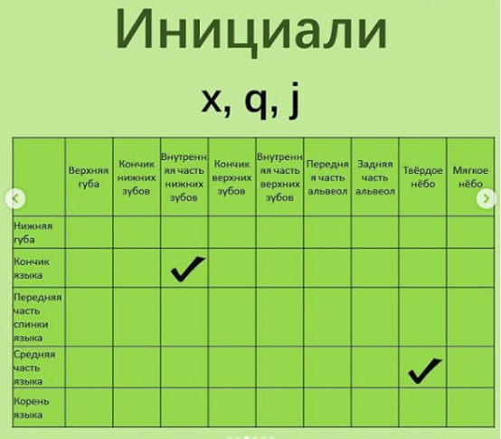
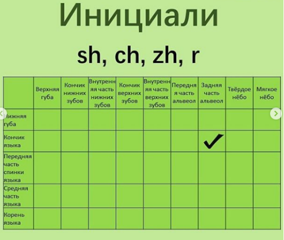
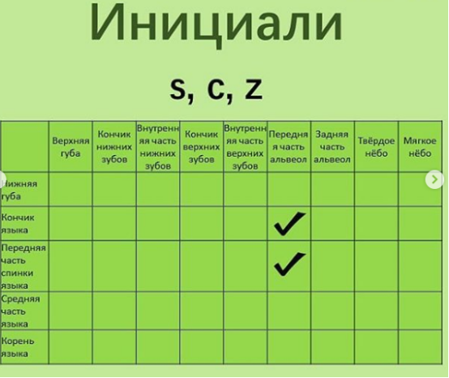

# Урок 2

## Ссылки

- http://zhongwen.com/
- app: pleco
- https://www.digmandarin.com/

## Фонетика

### x q j

#### x
Звук «x»: словно говорим русское «с», но при этом язык в плоском положении лежит внизу, и его кончик упирается в нижние зубы. Середина языка при этом сильно приближается к твёрдому нёбу, но НЕ касается его ни разу, оставляя щель. Получается шепелявое русское «с». Этот звук можно было бы бесконечно тянуть – звучит, как шипение змеи «xxxxxxx».

#### q

Звук «q»: язык в том же положении, что и в китайском «x»: лежит плоский внизу, а кончик упирается в нижние зубы. Теперь пытаемся сказать «ть». Отличие этого звука от китайского «x» в том, что середина языка не просто приближается к нёбу, но КАСАЕТСЯ его вначале.

#### j

Звук «j»: язык в том же положении, что и в китайских «q» или «x»: лежит плоский внизу, а кончик упирается в нижние зубы. Теперь пытаемся сказать «дь». Язык, соответственно, тоже вначале касается нёба. Отличие этого звука от китайского «q» в том, что в «j» используется голос, а в «q» – не используется. Т.е. «q» можно сказать шёпотом, а «j» – нет.

### sh ch zh r

#### sh

«sh» – кончик языка в плоском положении поднимается вверх в сторону твёрдого нёба, и словно говорим «ш». Губы при этом не двигаются. А челюсть сильно сжимается. Звук щелевой, т.е. кончик языка сильно приближается к нёбу, но ни разу НЕ касается его. Этот звук можно было бы бесконечно тянуть.

#### ch

«ch» – всё точно так же, как в «sh», но словно говорим в этом положении «ч». Этот звук придыхательный – т.е. произносить его нужно на сильном выдохе, словно пытаемся задуть пламя свечки. Кончик языка вначале касается нёба, поэтому звук смычный.

#### zh

«zh» – всё точно так же, как в «sh», но говорим в этом положении «дж». Звук полузвонкий, т.е. «включается» голос – значит, «zh» не получится сказать шёпотом. Кончик языка вначале касается нёба, поэтому звук смычный.

#### r

«r» – всё точно так же, как в «sh», но говорим в этом положении «ж» ил «р». В отличие от «sh», это звонкий звук. Чтобы его произнести, челюсть не нужно так сильно сжимать, как с «sh», и лишь слегка приближаться кончиком языка к задней части альвеол, но ни разу их не касаться.

Ren2 人

### s c z

#### s

«s» – язык в плоском положении приближается к альвеолам, и словно хотим произнести русское «с». Язык сильно приближается к альвеолам, но НЕ касается их, поэтому звук щелевой – его можно было бы бесконечно тянуть: «ssssssssss».

Китайский звук «s» сильно отличается по артикуляции от русского «с», ведь в русском «с» кончик языка упирается в нижние зубы!

#### c

«c» – язык в том же положении, что и в «s», но словно хотим произнести «ц». Язык вначале касается альвеол, поэтому звук смычный. Ещё он придыхательный – произносим его на сильном выдохе, словно хотим задуть пламя свечки.

#### z

«z» – язык в том же положении, что и в «s», но словно хотим произнести «дз». Язык вначале касается альвеол, поэтому звук смычный. Ещё он звонкий – т.е. шёпотом не получится произнести «z».

## Китайские инициали-аффрикаты: c, z, ch, zh, j, q

## Ключи

