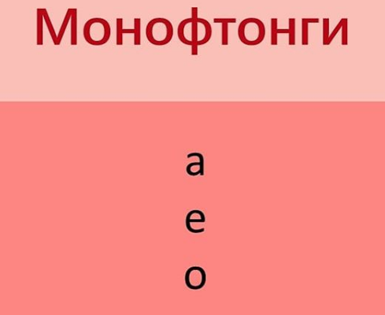

# Урок 3. Финали и монотонги

## Псевдоинициали: ye, wo, wu

К финали нужен инициаль. **Исключения:** é, o.

- uo -> wo 
- ie -> ye
- ua -> wa

y, w - псевдоинициали.

man4, mang2

Эризация свойственна северу. r - еще более задний

о, у -- губы не вытягиваются в трубочку

Гласные -- передние, задния; открытые, закрытые.

- Монотонги
- Дифтонги
- Трифтонги

## Монотонги

### i
- Слога: bi, pi, mi, di, ti, ni, li, ji, qi, xi, yi.

В слоге «yi» нет инициали, поэтому спереди пишется «y». Произносится слог «yi» просто как отдельная «i».

### ü

- Слога: nü, lü, ju, qu, xu, yu. Заметьте, что в слогах «ju, qu, xu, yu» точки над «u» не ставятся, но в них тот же самый звук «ü».

- Звук «ü» отличается от «i» только тем, что при его произнесении губы складываются в трубочку. Поэтому для тренировки звука «ü» нужно сначала протяжно произносить «i», затем, оставаясь в этом положении, сдвинуть губы в трубочку.

han4yu3 汉语 китайский

### i* -> i

- Вот как записываются все слога с особой финалью «i*»: zi, ci, si, zhi, chi, shi, ri.

Скорее согласный.

### u

Слога: bu, pu, mu, fu, du, tu, nu, lu, zu, zu, cu, su, zhu, chu, shu, ru, gu, ku, hu, wu.
 
В слоге «wu» нет инициали, поэтому спереди пишется «w». Произносится слог «wu» как отдельный «u», только произносим его, словно одними губами: за счёт смыкания губ слышится лёгкий согласный призвук, похожий на английский «w».

### a e o

### a 

- Слога с «a»: ba, pa, ma, fa, da, ta, na, la, za, ca, sa, zha, cha, sha, ga, ka, ha, a.

### e

- Слога с «е»: me, de, te, ne, le, ze, ce, se, zhe, che, she, re, ge, ke, he, e.

### о

Во тех слогах с «о», где есть инициаль, на самом деле два звука – «uo» (дифтонг). Но «u» почти незаметен, поэтому в пиньине не пишется.

guo

- Слога с «о»: bo, po, mo, fo, o Только в последнем слоге без инициали слышится лишь один звук «о», без «u» вначале.

## Дифтонги

- Нисходщие -- акцент на первой.
- Восходящие -- акцент на второй.

### ei

В финали «ei» звуки совсем другие – не как в монофтонгах «e» и «i». Здесь «е» передняя, т.е. язык придвинут ближе к зубам, а «i» короткая – как менее интенсивный русский «й».

- Слога: bei, pei, mei, fei, dei, nei, lei, zei, zhei, shei, gei, kei, hei, ei.

### ai

Финаль «ai» тоже передняя – рот сначала широко открывается, затем оканчивается менее интенсивным, чем русский «й».

- Слога: bai, pai, mai, dai, tai, nai, lai, zai, cai, sai, zhai, chai, shai, gai, kai, hai, ai.

### ou

Финаль «ou» произносится с отодвинутым назад языком: сначала более длинный чёткий «о», а в конце рот чуть сильнее закрывается, губы больше смыкаются, и получается очень короткий «u».

- Слога: pou, mou, fou, dou, tou, nou, lou, zou, cou, sou, zhou, chou, shou, rou, gou, kou, hou, ou.

### ao

Финаль «ao» – задняя. Сначала произносится «а» с широко раскрытым ртом, затем рот прикрывается, губы округляются, и в конце получается короткий звук «u». Именно «u», хотя записывается «о». Специально «u» произносить не нужно – он получится сам за счёт округления губ.

- Слога: bao, pao, mao, dao, tao, nao, lao, zao, cao, sao, zhao, chao, shao, rao, gao, kao, hao, ao.

## Носовые дифтонги

### en

В слогах с «en» язык занимает нейтральное положение, лежит плоско, а рот слегка приоткрыт. В этом дифтонге звук «е» похож на русский «э». Слог заканчивается на «n» - ТВЁРДЫЙ согласный: кончик языка касается альвеол.

hen3 很 

- Слога: ben, pen, men, fen, den, nen, zen, cen, sen, zhen, chen, shen, ren, gen, ken, hen, en.

### an

В слогах с «an» язык тоже лежит плоско, а рот открывается широко. Заканчивается на аналогичный с «en» носовой твёрдый звук «n».

- Слога: ban, pan, man, fan, dan, tan, nan, lan, zan, can, san, zhan, chan, shan, ran, gan, kan, han, an.

### eng

В слогах с «eng» звук «е» более открытый – ближе к «а», чем к «э». И он становится задним звуком – за счёт того, что оканчивается на задний согласный «ng».

heng4

- Слога: beng, peng, meng, feng, deng, teng, neng, leng, zeng, ceng, seng, zheng, cheng, sheng, reng, geng, keng, heng, eng.

### ang

В слогах с «ang» звук «a» полностью открытый и задний.

Слога: bang, pang, mang, fang, dang, tang, nang, lang, zang, cang, sang, zhang, chang, shang, rang, gang, kang, hang, ang.

