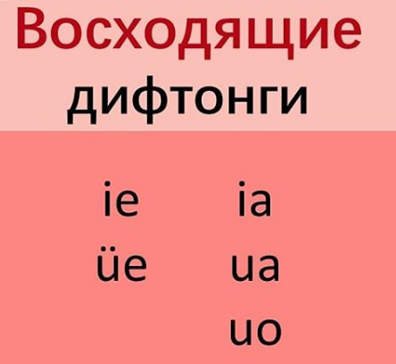
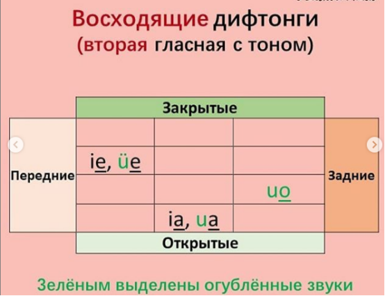
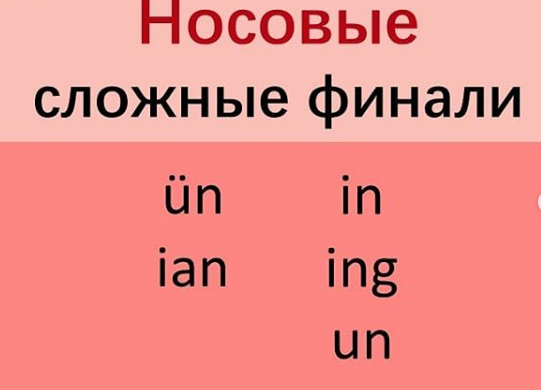
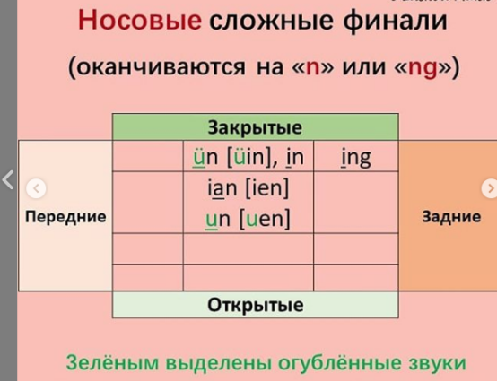

# Урок 4. Восходящие дифтонги

## ie üe ia ua uo

xiě, duō

Вторая гласная -- сильная.

### ie

Слоги с «ie»: bie, pie, mie, die, tie, nie, lie, jie, qie, xie, ye. В финали «ye» нет инициали, так что вначале вместо «i» пишется «y» и слышится внача

### üe 

В «üe» губы вначале округлены и сжаты для произнесения очень короткого «ü», затем сразу переходим к переднему звуку «е».

xue2 学

### ia

В «ia» широко открыт рот при произнесении конечной «а». Вначале губы растянуты для произнесения очень короткого «i», затем сразу переходим к «а».

jia1  家

Слога с «ia»: jia, qia, xia, ya. В финали «ya» нет инициали, так что вначале вместо «i» пишется «y» и слышится вначале короткий призвук «й».

### ua

В «ua» губы вначале округлены для произнесения очень короткого «u», затем сразу переходим к «a».

Слога с «ua»: zhua, chua, shua, rua, gua, kua, hua, wa. В слоге «wa» вначале слышится губной передний похожий на английский «w».

### uo

В «uo» губы округлены с самого начала: оба звука в ней огублённые. Сперва произносится короткий «u», затем сразу переходим к более длинному «о». Финаль задняя, потому что язык при произнесении «о» отодвигается назад.

Слоги: duo, tuo, nuo, luo, zuo, cuo, suo, zhuo, chuo, shuo, ruo, guo, kuo, huo, wo.

## Носовые сложные финали

### ün

В финали «ün» в середине слышится призвук «i» – получается «üin». Но «i» не нужно произносить специально – просто во время произнесения «n» нужно растянуть губы.

Слога: jun, qun, xun, yun. Заметьте, что точки над «u» не ставятся! В «yun» нет инициали, поэтому вначале добавляется «y».

### ian

В финали «ian» более закрытый звук «a», поэтому он ближе к «е» – получается почти «iеn». Вначале губы растянуты для короткого «i», затем рот приоткрывается для более чёткого «en».

- ian / iang
- yan / yang

Слога: bian, pian, mian, dian, tian, nian, lian, jian, qian, xian, yan. В «yan» нет инициали, поэтому вместо «i» пишется «y», который звучит как короткий «й».

В финалях «in» и «ing» губы растянуты, и также остаются на протяжении всей финали.

Слога «in»: bin, pin, min, nin, lin, jin, qin, xin, yin. В «yin» нет инициали, поэтому вначале добавляется «y».

Слога «ing»: bing, ping, ming, ding, ting, ning, ling, jing, qing, xing, ying. В «ying» нет инициали, поэтому вначале добавляется «y», который звучит как короткий «й».

Дальше был учебник.

### Изменение тона

- 3 + 3 => 2 + 3

ni3 ne -- а ты

ye -- между подлежащим и сказуемым

#### Общая структура:

подлежаешьее, обстоятельство, сказуемое, дополнение.

