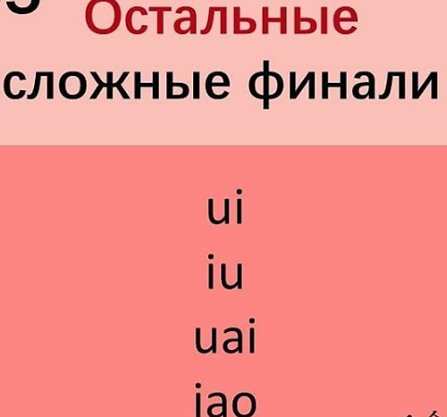
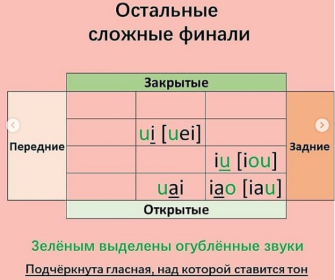

# Урок 5. Остальные сложные финали

## ui iu uai ioa

### ui

В «ui» посередине слышится лёгкий «е» ("э") – но его не следует произносить специально: просто во время произнесения «i» нужно растянуть губы. Начальный звук «u» очень короткий, основной более чёткий и длинный звук – «e», заканчивающийся на лёгкий «й» («i»).

Слоги: dui, tui, zui, cui, sui, zhui, chui, shui, rui, gui, kui, hui, **wei**. В «wei» нет инициали, поэтому вместо «u» пишется «w» и прописывается тот самый звук «e». Вначале звучит похожий на английский «w» (губной).

### iu

В «iu» посередине слышится «о», особенно чётко в третьем тоне. Вначале губы растянуты, произносят короткий «i», и тут же переходят на «ou», «u» – самый чёткий конечный звук.

Слоги: miu, diu, niu, liu, jiu, qiu, xiu, **you**. В «you» нет инициали, поэтому вместо «i» пишется «y», который звучит как короткий «й» и в середине тот самый «о».

### uai

В «uai» основной звук – «а», «u» произносится очень коротко, вся финаль заканчивается на лёгкий «й» («i»).

Слоги: zhuai, chuai, shuai, guai, kuai, huai, **wai**. В «wai» нет инициали, поэтому вместо «u» пишется «w» и прописывается тот самый звук «e». Вначале звучит похожий на английский «w» (губной).

### ioa

В «iao» основной звук – «а». Сначала губы растянуты для короткого «i», затем сразу произносится «а» с широко раскрытым ртом, и в конце рот прикрывается, а губы округляются, и получается короткий звук «u». Именно «u», хотя записывается «о».

Слоги: biao, piao, miao, diao, tiao, niao, liao, jiao, qiao, xiao, **yao**. В «yao» нет инициали, поэтому вместо «i» пишется «y», который звучит как короткий «й».

## Что-то

